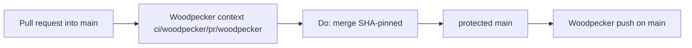

# Architecture

```
  Terra LCD          BSC JSON-RPC
      │                   │
      ▼                   ▼
 ┌────────────────────────────────┐
 │  voting-ledger                 │  writer role
 │  register live balance         │
 │  CW20 wasm events (CL8Y only)  │
 │  BEP-20 Transfer logs (CL8Y)   │
 └────────────────┬───────────────┘
                  │ SECURITY DEFINER
                  │ voting_cl8y_balance_at
                  │ voting_bsc_cl8y_balance_at
                  ▼
 ┌────────────────────────────────┐
 │  operator-voting (Axum)        │  restricted role
 │  ADR-36 + EIP-191              │
 │  drafts / comments / open    │
 │  proposals / votes / blacklist │
 └────────────────┬───────────────┘
                  │ HTTPS
                  ▼
 ┌────────────────────────────────┐
 │  voting dApp                   │
 │  Legal TermsGate (required)    │
 │  Terra wallet ← DEX patterns   │
 │  EVM wallet   ← Bridge patterns│
 └────────────────────────────────┘
```

## Layout

```
ledger/              # Rust: ingest + Postgres migrations + balance functions
operator-voting/     # Rust Axum: signatures, proposals, votes
frontend/            # Vite React: /, /new, /:id (+ /vote* aliases, #8)
docs/ skills/        # invariants + agent playbooks
docs/adr/            # architecture decisions (0001: catch-all CODEOWNERS)
deploy/              # grants.sql, Coolify env, Dockerfiles (issue #7)
docs/OPS.md          # Coolify / Legal / live QA / rate limits
```

Three deployables (ledger worker, API, dApp) and **two** DB roles. Coolify images: [`../deploy/docker/`](../deploy/docker/). Public-expose checklist: [OPS.md](OPS.md) (issue [#7](https://gitlab.com/PlasticDigits/voting/-/issues/7)). SPA documents for Legal return: [FRONTEND.md](FRONTEND.md) (issue [#8](https://gitlab.com/PlasticDigits/voting/-/issues/8), invariant O8). Default GET `/v1/balances` clamp: [OPERATOR_VOTING.md](OPERATOR_VOTING.md) OV-B1 (issue [#9](https://gitlab.com/PlasticDigits/voting/-/issues/9)). Proposal template: [OPERATOR_VOTING.md](OPERATOR_VOTING.md) OV-S (issue [#10](https://gitlab.com/PlasticDigits/voting/-/issues/10)). WalletConnect pairing (cosmes patch, project id, CSP frames): [FRONTEND.md](FRONTEND.md) (issue [#12](https://gitlab.com/PlasticDigits/voting/-/issues/12)). Pending registration retry: [FRONTEND.md](FRONTEND.md) (issue [#14](https://gitlab.com/PlasticDigits/voting/-/issues/14)).

Catch-all `CODEOWNERS` removal is [ADR 0001](adr/0001-remove-catchall-codeowners.md) ([#30](https://git.cl8y.com/code/voting/issues/30)). Merge gate **H30** and pipeline path/layout are below. Do not duplicate that ADR narrative. Local invariant IDs are **H30-*** (this ticket). Sister **H15** / **H5** / **MG** tables are other trees’ copies of the same flags, not this repo’s issue number.

## Snapshot

A proposal **draft** does not freeze the electorate. Committee `open_vote` records `{ terra_height, bsc_block }` from current `indexer_state` tips (wall-clock aligned). Terra voters use the CW20 ledger at that height. EVM voters use the BEP-20 ledger at that block. Do not convert via USD. Register **before votes open**. Details: [OPERATOR_VOTING.md](OPERATOR_VOTING.md) OV-D1–D6 (issue [#11](https://gitlab.com/PlasticDigits/voting/-/issues/11)).

## Double-count

Today the CW20 and BEP-20 supplies are separately circulating (not lock-and-mint in this repo). Each address votes its own chain balance. If an official bridge later locks units, exclude the lock address explicitly.

## Related on-chain governance (not this product)

DEX factory `governance` / wasm admin is the multisig `terra1zlmv2xydxcusurtr6rl78wsvytdc6mfex6hep7` in `cl8y-dex-terraclassic`. Offchain polls here do **not** migrate contracts or change factory fees. UI copy must not imply on-chain DAO finality. Hybrid vote-scope (leadership proposes, holders ratify): [GOVERNANCE_RESEARCH.md](GOVERNANCE_RESEARCH.md) (issue [#13](https://gitlab.com/PlasticDigits/voting/-/issues/13)).

## Merge gate (H30)

Protected `main`. Operator `GET /api/v1/repos/code/voting/branch_protections` for the `main` rule. **Attested** GET `updated_at` 2026-09-21T07:29:30Z (after [cl8y-forgejo#48](https://git.cl8y.com/PlasticDigits/cl8y-forgejo/issues/48) rollout on this repo). Unauthenticated GET returns **401** (`token is required`); close still **re-GETs**. Flag *values* match the canary table in `code/hello` architecture **H15**; IDs here are **H30-*** because this ticket is [#30](https://git.cl8y.com/code/voting/issues/30).

This tree does not PATCH Forgejo protection JSON, change CAC autoland predicates, Coolify `vote.cl8y.com` hosting, Legal admin, or product runtime. Those remain [cl8y-forgejo#48](https://git.cl8y.com/PlasticDigits/cl8y-forgejo/issues/48), [cl8y-agent-control#429](https://git.cl8y.com/PlasticDigits/cl8y-agent-control/issues/429), and [agent-control #297](https://git.cl8y.com/PlasticDigits/cl8y-agent-control/issues/297). Do not add a local `docs/INVARIANTS.md`; the issue body points at [cl8y-forgejo’s copy](https://git.cl8y.com/PlasticDigits/cl8y-forgejo/src/branch/main/docs/INVARIANTS.md).

A green Woodpecker `find` / `tree`-named clone-check, or a green GitLab `test:rust` / `lint:gitleaks` job, is **not** proof of **H30-2**, **H30-3**, **H30-5**, **H30-8**, or **H30-9**. #30 must not PATCH protection. Re-read at merge; fail on drift from the table below.

Public `GET /api/v1/repos/code/voting/branches/main` (this session) already shows `protected: true`, `required_approvals: 0`, `enable_status_check: true`, `status_check_contexts: ["ci/woodpecker/pr/woodpecker"]`, `user_can_push: false`, `user_can_merge: false`. That payload does **not** attest `block_on_official_review_requests`, `block_on_rejected_reviews`, `enable_push`, or the observed rows; those are admin GET fields.

### GET-required (close criterion 4 and test 3 — same list)

These are the only protection fields this ticket depends on.

| ID | Field | Required value (attested 2026-09-21T07:29:30Z) |
| --- | --- | --- |
| **H30-2** | `enable_push` | `false` (no direct `main`, no force-push) |
| **H30-3** | `enable_status_check` + `status_check_contexts` | `true` and `ci/woodpecker/pr/woodpecker` |
| **H30-5** | `block_on_rejected_reviews` | `true` |
| **H30-8** | `block_on_official_review_requests` | `false` (leftover official requests on [#30](https://git.cl8y.com/code/voting/pulls/30) / [#29](https://git.cl8y.com/code/voting/pulls/29) must not block) |
| **H30-9** | `required_approvals` | `0` |

Do not include **H30-4** (`Do: merge`) in GET matching: it is the merge API, not a protection field.

### GET-observed (do not touch; not in close matching)

| Field | Observed value | Rule |
| --- | --- | --- |
| `block_on_outdated_branch` | `true` | Do not PATCH from #30. Product head must rebase onto current `main` before merge. |
| `dismiss_stale_approvals` | `true` | Do not PATCH from #30. |
| `apply_to_admins` | `false` | Do not PATCH from #30. |

Close criterion 4 / test 3 must **not** be read as “GET equals this whole architecture table.” Observed rows are inventory so an implementer does not “fix” them.

### Non-GET rules

| ID | Rule |
| --- | --- |
| **H30-1** | No `CODEOWNERS` at the four Forgejo search paths (repo root, `docs/CODEOWNERS`, `.gitea/CODEOWNERS`, `.forgejo/CODEOWNERS`) requesting a user or team. File line is `@code/maintainers`; PR JSON team `name` is `maintainers` (org `code`, team id 4). Either form is the same leftover plant. Do not leave an empty or comments-only file; Forgejo still parses it. This tree has no vendor `CODEOWNERS`. |
| **H30-4** | Merge is SHA-pinned `Do: merge` (`head_commit_id`). Never document or use `force_merge`. |
| **H30-6** | No Coolify/Woodpecker secrets on `pull_request`. This tree does not grow a `vote.cl8y.com` deploy, Legal admin, or ledger-writer step from #30. Hello `telegram-failure` is forbidden. Coolify / Legal ops stay [#7](https://gitlab.com/PlasticDigits/voting/-/issues/7) / #297. |
| **H30-7** | This tree does not expand CAC merge/deploy/spend/custody policy. |

Official CODEOWNERS review is **not** a merge gate. Forgejo loads the first existing file among `CODEOWNERS`, `docs/CODEOWNERS`, `.gitea/CODEOWNERS`, and `.forgejo/CODEOWNERS` (Go-regexp, not GitHub globs). A catch-all `.*` still plants team `maintainers` on every non-WIP PR that changes a matching path. After ADR 0001, `test -f` fails on all four (**H30-1**). None of those paths may contain a reviewer rule for any pattern.

Root README must point at this gate and ADR 0001 (product tables stay; add the Decision 3 paragraph on the product PR). Architecture-only is not a substitute for that pointer.



[`.gitlab-ci.yml`](../.gitlab-ci.yml) is leftover GitLab hosting CI (gitleaks + cargo lib/integration + frontend unit + SPA fallback). Forgejo `has_actions=false`; that workflow **does not** post `ci/woodpecker/pr/woodpecker`. A red GitLab check is not a merge hold. Do not drop **H30-3** to “use GitLab instead.” Do not delete `.gitlab-ci.yml` in #30.

Product ledger / operator-voting / frontend invariants (L*, OV-*, O8, L-EVM*) stay in [LEDGER_INVARIANTS.md](LEDGER_INVARIANTS.md), [OPERATOR_VOTING.md](OPERATOR_VOTING.md), and [FRONTEND.md](FRONTEND.md). This overview does not weaken them.

## Pipeline

`status_check_contexts` stays `ci/woodpecker/pr/woodpecker` (**H30-3**). Today this tree has **no** root `.woodpecker.yaml`. Commit statuses on `main` (`1006f8b`) and occupying [#30](https://git.cl8y.com/code/voting/pulls/30) (`eb352b8`) are **empty**. Empty statuses with no YAML are ambiguous: missing file **or** repo not registered as a Woodpecker project. A posting **success** `ci/woodpecker/pr/woodpecker` from Woodpecker (`ci.cl8y.com`) is a **land prerequisite** for ADR 0001 (**WP-pre**), not leftover and not a reason to drop **H30-3** or `force_merge`.

**MUST path:** repository-root `.woodpecker.yaml`. Do not add `.woodpecker.yml`. Do not add `.woodpecker/` (directory mode can ignore root YAML and name the workflow from the filename, posting `ci/woodpecker/pr/<other>` and failing **H30-3**).

**#30 land bootstrap** (not this repo’s product test gate). Implement MUST add exactly this file. Cargo tests, frontend `npm test` / Playwright, SPA fallback, and GitLab gitleaks stay **ungated** by this ticket. Any later real Forgejo CI **must extend this same root file**.

```yaml
# #30 land bootstrap. Posts context `ci/woodpecker/pr/woodpecker`.
# Not this repo's product test gate. Cargo, npm, and GitLab jobs stay ungated.
# Any later real CI must extend this same root file.
# MUST path: repository-root `.woodpecker.yaml`.
# Do not add `.woodpecker.yml` or `.woodpecker/`.

when:
  - event: [push, manual]
    branch: main
  - event: pull_request

steps:
  - name: tree
    image: alpine:3.22@sha256:14358309a308569c32bdc37e2e0e9694be33a9d99e68afb0f5ff33cc1f695dce
    commands:
      - test -n "$(find . -type f ! -path './.git/*' | head -1)"
```

`when:` is two list items: `push`/`manual` on `main`, plus **unfiltered** `pull_request`. Do not attach `branch: main` to `pull_request` (that skips feature-branch PRs and never posts the required context). `steps:` syntax, not `pipeline:`. Image is the hello/dex digest pin, not a floating tag. Command is the Token-SC / OTC / BASE_Buster / cmm `find` one-liner. Stock Alpine has no `tree` binary; do not `apk add tree`. Step name `tree` is the org stub name; the command is still `find`. No secrets, Coolify, Telegram, BSC RPC, or Terra LCD. Do not copy hello’s `coolify-deploy` / `telegram-failure`. Do not copy dex’s `scripts/ci/gitleaks-scan-tracked.sh` (that script does not exist here). Do not port `.gitlab-ci.yml` `test:rust` / `test:frontend` / `lint:gitleaks` onto this PR.

**WP-enable (pre-merge gate, before combining onto `#30`).** Confirm `code/voting` is an active Woodpecker project (Forgejo repo id **43** on `ci.cl8y.com`; webhook to `https://ci.cl8y.com/api/hook` for `push` + `pull_request`). File owner (`#30` implement) ≠ posting owner (forge ops). dex#1247 recorded 44/44 `code/*` enablement on 2026-09-12; that historical count is **not** this preflight. If the quoted YAML is on the PR and nothing posts: **land blocked** — open or wait on a **named** forge unblock ([cl8y-forgejo#48](https://git.cl8y.com/PlasticDigits/cl8y-forgejo/issues/48) or a local leftover shaped like [dex#1247](https://git.cl8y.com/code/cl8y-dex-terraclassic/issues/1247)) **plus retrigger**. Do not POST a fake commit status. Do not `force_merge`. Do not drop **H30-3**. Owners: ADR 0001 Decision 8.

Coolify / Legal admin / live wallet QA stay [#7](https://gitlab.com/PlasticDigits/voting/-/issues/7) and [#297](https://git.cl8y.com/PlasticDigits/cl8y-agent-control/issues/297), not merge policy.

Root `.gitignore` already tracks `docs/` (`ARCHITECTURE.md` is on `main`). Do not add a `docs/` ignore. Do not add a directory ignore of `docs/CODEOWNERS` as a substitute for **H30-1** (absence, not ignore).
